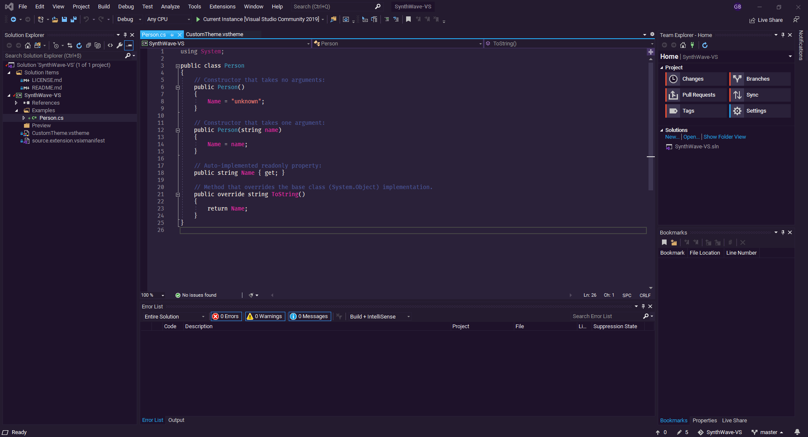

# SynthWave '84 - Visual Studio theme

An attempt to port the awesome [SynthWave '84 - VS Code theme](https://github.com/robb0wen/synthwave-vscode 'SynthWave \'84 - VS Code theme') by [Robb Owen](https://github.com/robb0wen 'Robb Owen') to Visual Studio 2019 or 2022.

## Recommended fonts

* Text Editor: [FiraCode Medium](https://github.com/tonsky/FiraCode 'FiraCode Medium')
* Environment: [Roboto](https://fonts.google.com/specimen/Roboto 'Roboto Medium')
* All Text Tool Windows: [Roboto](https://fonts.google.com/specimen/Roboto 'Roboto')

## Setup

### VS 2019
Install [Visual Studio Color Theme Designer](https://marketplace.visualstudio.com/items?itemName=ms-madsk.ColorThemeDesigner 'Visual Studio Color Theme Designer').

### VS 2022
Install [Visual Studio Color Theme Designer 2022](https://marketplace.visualstudio.com/items?itemName=idex.colorthemedesigner2022 'Visual Studio Color Theme Designer 2022')

## Install

* Clone this repository
* Open the solution in VS
* Open file `CustomTheme.vstheme`
* Aplly
* Restart VS
